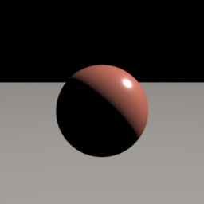
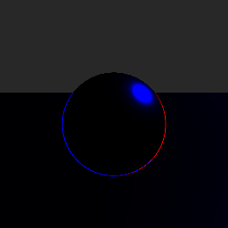

# Entry 1
## Does a splat carrying exact PBR attributes relight correctly?

This is a "calibration" test for some important qualifications if this project is to work out. If a splat can't be relit correctly from the albedo/roughness/normal instead of just view-dependent color like normal gaussian splats, then the premise is dead in the water.

Got claude to whip up some python scripts and a blender scene and use that as a ground truth to compare our splat reconstructions

**Command:**
```
blender scene.blend -b -P render_aovs.py -- --stage 1 --out ./s1 --res 256 --samples 128
python3 relight.py s1/A_aovs.exr s1/scene.json s1/mine.exr
python3 diff.py s1/mine.exr s1/B_truth.exr --mask s1/A_aovs.exr --out s1/diff.exr
```

**Result:**
```
energy ratio       0.9744   (1.0 = perfect)
relative L1         2.68 %
  unlit pixels   9,214 (22.8%), holding 4.8% of all error
  lit pixels     relative L1   2.61 %
LF fraction         27.0 %  -> high-frequency residual
```

2.68%, which is over the ~2% I was told to expect initially. Not great,
day one and it's already broken. But when opening the diff image next to the ground truth render:




...it's probably actually fine. The error is pretty much in two spots:

- 97.2% of the surface (the actual diffuse shading which is the part the
  hypothesis is really about) is basically dead-on. Mean error ~0.005.
- A tiny handful of pixels right on the specular highlight (0.65%)
  is eating 72.8% of the total error. Thought this might just be Cycles
  noise, so had claude check again at 2048 samples (16x more) but number didn't move at
  all. So not noise. It's probably `relight.py` shading the GGX highlight with one
  ray per pixel while Cycles integrates over many sub-pixel samples per
  pixel. Not really gonna worry abt that now and just gonna push through.
- The remaining 2.15% of pixels at the edge of the sphere hold
  4.9% of the error. The antialiased-edge thing the runbook warned about
  in advance (Position/Normal get blended nonsense where a pixel straddles
  two surfaces). Known, ignoring it for now.

So does material-not-appearance actually relight correctly at all? Yes.
The 2.68% isn't ideal for a calibration test but i think most of it is explainable as unrelated artifacts on an otherwise essentially exact match.
Calling stage 1 a pass, on to stage 2.
