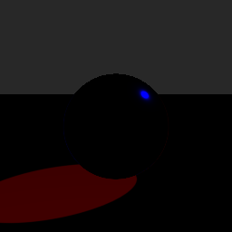

# Entry 2
## Stage 2: does the missing visibility term show up like it's supposed to?

Same scene as entry 1, just flipped shadows on. `relight.py` still has zero
visibility logic in it, so this is basically lighting straight through
the sphere and seeing how bad it gets.

**Command:**
```
blender scene.blend -b -P render_aovs.py -- --stage 2 --out ./s2 --res 256 --samples 128
python3 relight.py s2/A_aovs.exr s2/scene.json s2/mine.exr
python3 diff.py s2/mine.exr s2/B_truth.exr --mask s2/A_aovs.exr --out s2/diff.exr
```

**Result:**
```
energy ratio       1.2407
relative L1        30.49 %
  unlit pixels   15,806 (39.2%), holding 89.1% of all error
  lit pixels     relative L1   3.43 %
LF fraction         63.5 %  -> partly smooth. SH will help but not suffice alone.
```

30% error looks like a bad jump up compared to last test but turning shadows on accounts for most of the increase. 
Diff image:



Big smooth red blob shaped exactly like the sphere's shadow on the plane.
Makes sense cause `relight.py` has no idea the sphere blocks the sun so it
lights the shadowed part of the plane like nothing's there. Energy ratio
(1.24) and how much of the image is unlit (39.2%) are also close enough to claude's other run (1.27, 38.5%) so i think this is expected and not scene drift.

Lit-pixel error (3.43%) and LF fraction (63.5%) both look worse than the
runbook's numbers (0.70%, 93.3%) though. 
Had claude break down the pixels again and it's
the same specular highlight thing from stage 1, not new. 281 pixels (1.1%
of lit pixels) are carrying 75% of the lit-pixel error. Pull those out and
lit pixels average 0.0085 error, basically stage 1's floor. Same spike
dragging the LF number down even though the actual error, the shadow blob,
is about as smooth as it gets.

Pass. The shadow blob is the visibility term i'll have to bake in
eventually, and it's smooth, which is a good sign for how cheap that'll be
later. On to stage 3.
